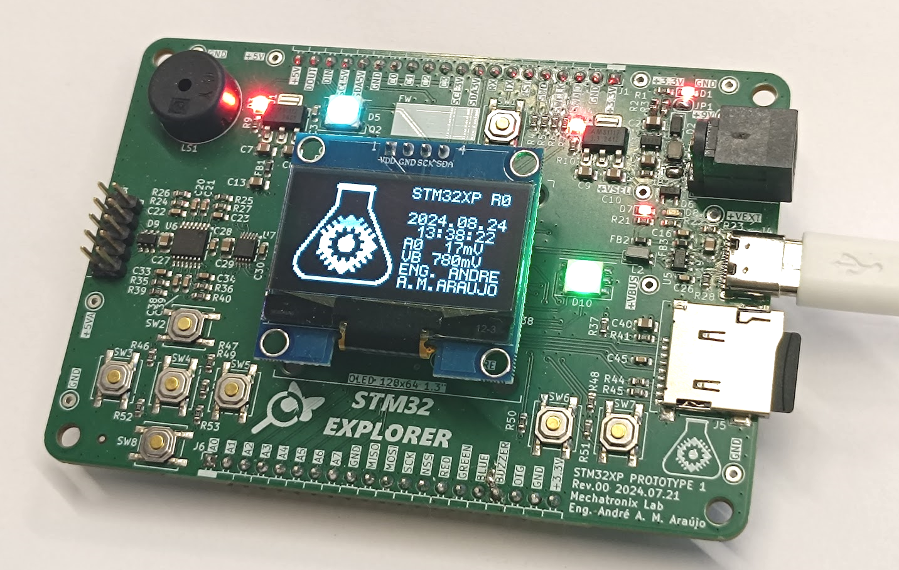
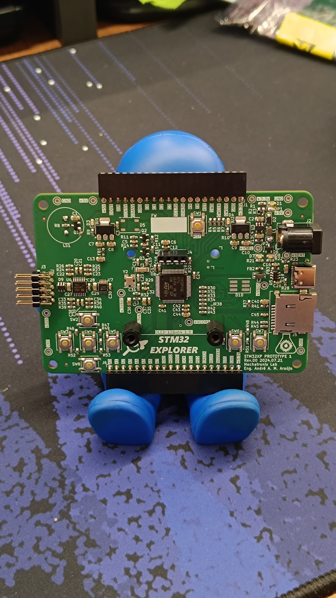
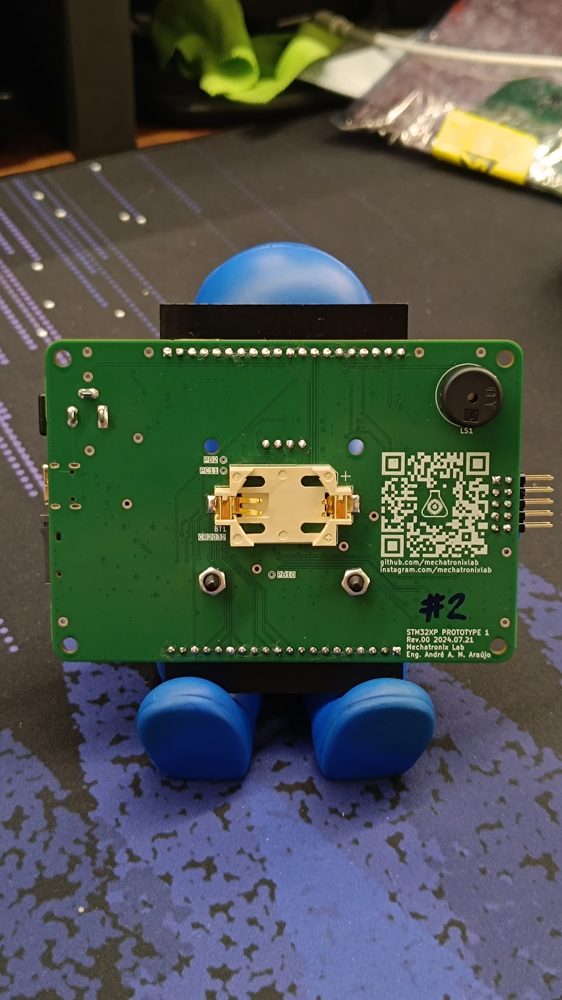
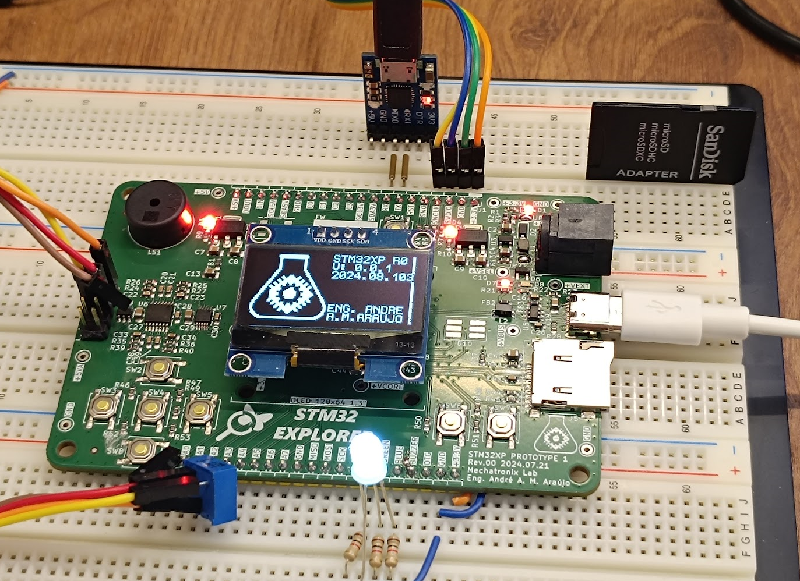
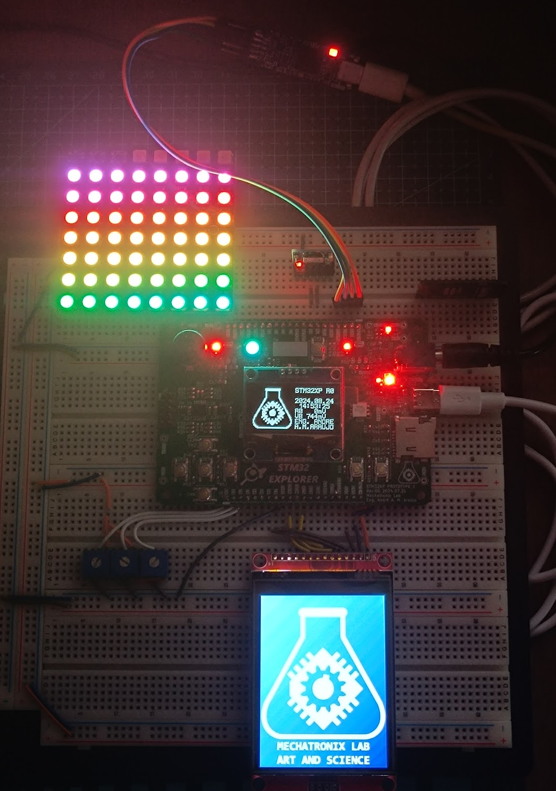

# STM32 Explorer Board - STM32XP
  
This is an educational development board conceived as part of a PCB Design course. The course is offered via [**Portal Embarcados**](https://embarcados.com.br/) website [**Course Page**](https://cursos.embarcados.com.br/cursos/projeto-de-pcb-para-sistemas-embarcados/).

## License

This is an open source hardware project licensed under CERN-OHL-P. More details on [license file](./LICENSE.md).

## Board scpecifications

The board is based on the [**STM32F411**](https://www.st.com/en/microcontrollers-microprocessors/stm32f411.html), more specifically, the [**STM32F411RET6**](https://www.st.com/en/microcontrollers-microprocessors/stm32f411re.html).
Additionally, the board features somo components commonly used in Embedded Systems, such as:
- DC-DC Converters
- OLED Display, connected to the MCU via I²C
- RGB LEDs
- Audio buzzer, controlled via PWM
- External ADC with analog antialiasing filters
- USB 1.1 Full Speed via a Tyoe-C connector
- Micro SD Card for easy data storage, connected to the MCU via SPI
- Input buttons
- Several I/O pins routed to breakout connectors/pins
- CR2032 Battery for RTC operation

  
## Firmware

A simple software application was developed to test each of the subsystems of the board.

## Tests

