# STM32 Explorer Board - STM32XP
  
This is an educational development board conceived as part of a PCB Design course. The course is offered via [**Portal Embarcados**](https://embarcados.com.br/) website ([**Course Page**](https://cursos.embarcados.com.br/cursos/projeto-de-pcb-para-sistemas-embarcados/)).

## License and certification
This is an open source hardware project licensed under CERN-OHL-P. More details on [LICENSE.md](./LICENSE.md).  

[OSHW] BR000018 | Certified open source hardware | [oshwa.org/cert](https://certification.oshwa.org/br000018.html).

## Board specifications

The board is based on the [**STM32F411**](https://www.st.com/en/microcontrollers-microprocessors/stm32f411.html), more specifically, the [**STM32F411RET6**](https://www.st.com/en/microcontrollers-microprocessors/stm32f411re.html).
Additionally, the board features some components commonly used in Embedded Systems, such as:
- DC-DC Converters
- OLED Display, connected to the MCU via I²C
- RGB LEDs
- Audio buzzer, controlled via PWM
- External ADC with analog antialiasing filters
- USB 1.1 Full Speed via a Type-C connector
- Micro SD Card for easy data storage, connected to the MCU via SPI
- Input buttons
- Several I/O pins routed to breakout connectors/pins
- CR2032 Battery for RTC operation

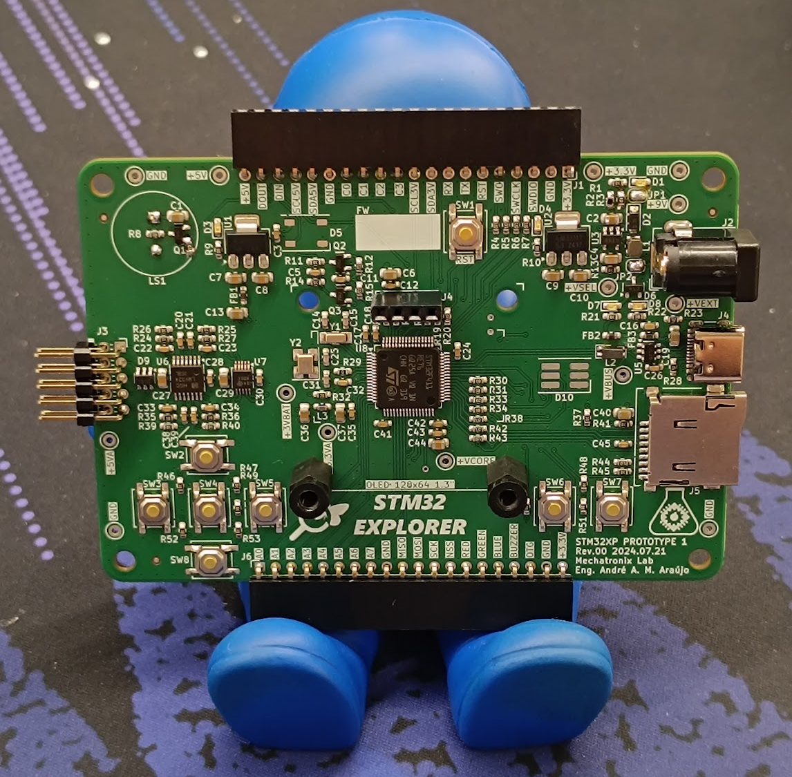

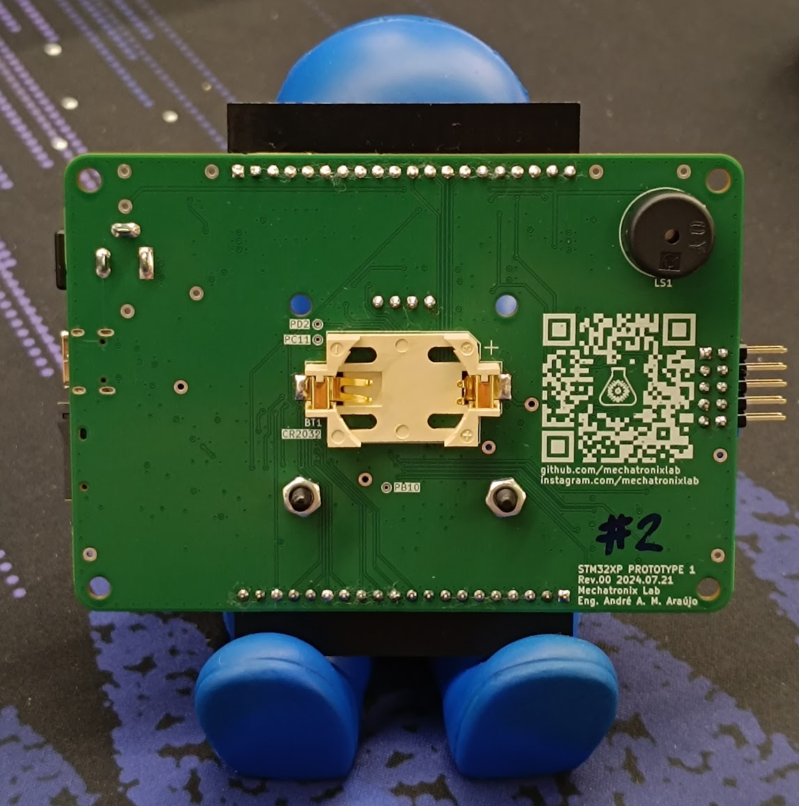
  
## Firmware

A simple software application was developed to test each of the subsystems of the board.

## Tests

# Breadboard Prototype

Before commiting to this design, a breadboard prototype was assembled for validation. This prototype used a Nucleo Board, development modules whenever possible, ICs and discrete electronic components. These parts can be easily acquired on electronics stores worldwide. The connections between modules follow very closely the [final schematic](https://github.com/MechatronixLab/STM32XP/blob/master/HARDWARE/KICAD/STM32XP.pdf) of the STM32XP Board. The same firmware runs on both the prototype and STM32XP Board.

  

## Parts list

| Part                                                                                                      | Image                                                              |
|-----------------------------------------------------------------------------------------------------------|:------------------------------------------------------------------:|
| [**NUCLEO-F411RE**](https://www.st.com/en/evaluation-tools/nucleo-f411re.html)                            |              |
| Breadboard Power Supply Module                                                                            | 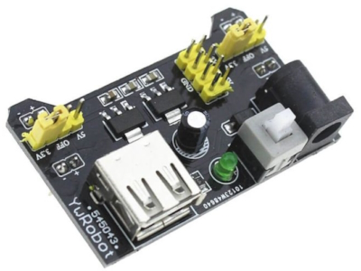    |
| 1.3" OLED Display Module                                                                                  | 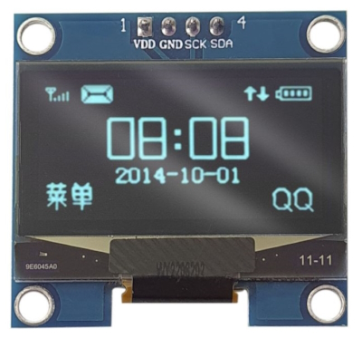                |
| ADS1115 ADC Module                                                                                        | 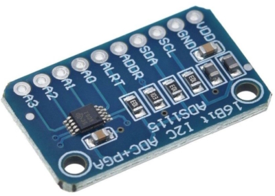             |
| Bidirectional Level Shifter Module                                                                        | 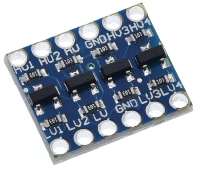 |
| Directional Tactile Switch Module                                                                         | 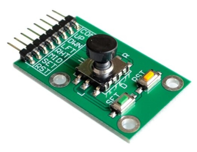   |
| Micro SD Card Module                                                                                      | 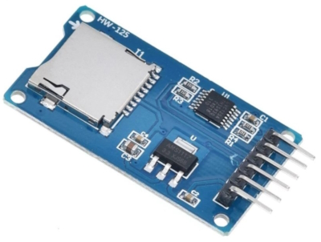            |
| LM324N + Passives (Anti-Aliasing Filter)                                                                  | 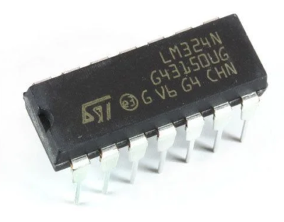                     |
| Passive Buzzer + 2N3904                                                                                   | 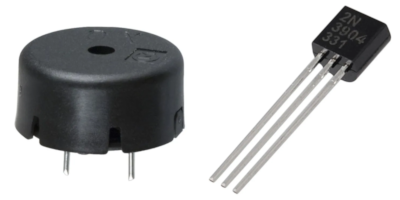                     |
| [**WSEN-ISDS**](https://www.we-online.com/en/components/products/WSEN-ISDS) (Left out of the final design)| 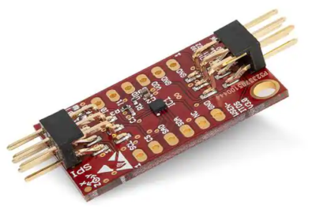                  |

